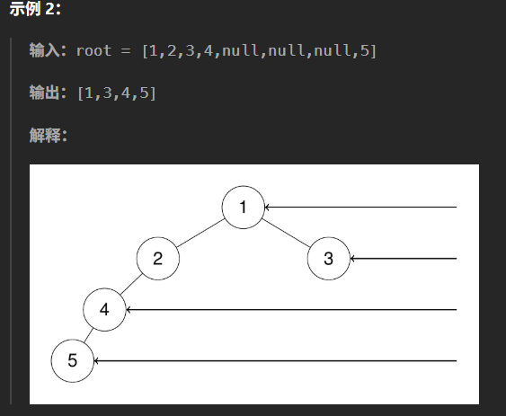

# 记录
- 题目：
  给定一个二叉树的 根节点 root，想象自己站在它的右侧，按照从顶部到底部的顺序，返回从右侧所能看到的节点值。
- 例：
  
- 思路：
  直接先序递归遍历，先进入右子树，记录每一层是否记录了视图，记录了则无视，没记录则记录。
  没什么好说的，一遍过，高时间空间利用率。
- 代码：
  ```cpp
    /**
  * Definition for a binary tree node.
  * struct TreeNode {
  *     int val;
  *     TreeNode *left;
  *     TreeNode *right;
  *     TreeNode() : val(0), left(nullptr), right(nullptr) {}
  *     TreeNode(int x) : val(x), left(nullptr), right(nullptr) {}
  *     TreeNode(int x, TreeNode *left, TreeNode *right) : val(x), left(left), right(right) {}
  * };
  */
  class Solution {
  public:
      vector<int> v;
      vector<int> rightSideView(TreeNode* root) {
          tool(root,0);
          return this->v;
      }
      void tool(TreeNode* root,int level){
          if(root == nullptr){
              return;
          } 
          if(this->v.size()<=level){
              this->v.emplace_back(root->val);
          }
          tool(root->right,level+1);
          tool(root->left,level+1);
      }
  };
  ```
- 结果：
  高时间空间利用率
- 他人的做法：
  层序遍历，使用队列。