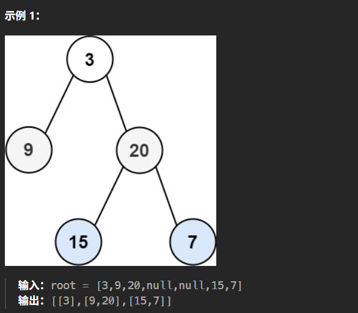

# 记录
- 题目：
  给你二叉树的根节点 root ，返回其节点值的 层序遍历 。 （即逐层地，从左到右访问所有节点）。
- 示例:
  
- 思路:
  毫无疑问的使用队列，把队首的左右子树分别push进队列就好。
  但是还需要考虑层级问题，每一层要放进不同队列中。于是我使用map来记每一结点的层级。
- 代码：
  ```cpp
    /**
  * Definition for a binary tree node.
  * struct TreeNode {
  *     int val;
  *     TreeNode *left;
  *     TreeNode *right;
  *     TreeNode() : val(0), left(nullptr), right(nullptr) {}
  *     TreeNode(int x) : val(x), left(nullptr), right(nullptr) {}
  *     TreeNode(int x, TreeNode *left, TreeNode *right) : val(x), left(left), right(right) {}
  * };
  */
  class Solution {
  public:
      vector<vector<int>> levelOrder(TreeNode* root) {
          queue<TreeNode*> q;
          map<TreeNode* ,int> c;
          vector<vector<int>> con;
          TreeNode* tem = root;
          c[root] = 0;
          q.push(tem);
          while(tem!=nullptr){
              if(c[tem]==con.size()){ 
                  con.emplace_back();
              }
              con[c[tem]].emplace_back(tem->val);
              if(tem->left!=nullptr){
                  c[tem->left] = c[tem] + 1;
                  q.push(tem->left);
              }
              if(tem->right!=nullptr){
                  c[tem->right] = c[tem] + 1;
                  q.push(tem->right);
              }
              q.pop();
              if(q.size()){
                  tem = q.front();
              }
              else{
                  break;
              }

          }
          return con;
      }
  };
  ```
- 结果：
  时间30%，内存80%
- 他人的做法：
  代码：
  ```cpp
  class Solution {
  public:
      vector<vector<int>> levelOrder(TreeNode* root) {
          vector<vector<int>> ans;
          pre(root, 0, ans);
          return ans;
      }
      
      void pre(TreeNode *root, int depth, vector<vector<int>> &ans) {
          if (!root) return ;
          if (depth >= ans.size())
              ans.push_back(vector<int> {});
          ans[depth].push_back(root->val);
          pre(root->left, depth + 1, ans);
          pre(root->right, depth + 1, ans);
      }
  };
  ```
  - 解析：
    这个是先序递归遍历，记录层级，把当前结点的值写入当前层级对应列表，因为是先记录，然后先左后右，所以写入的顺序对于每一层来说也是从左到右的。
  - 他的结果：
    时间复杂度O（n），空间57%