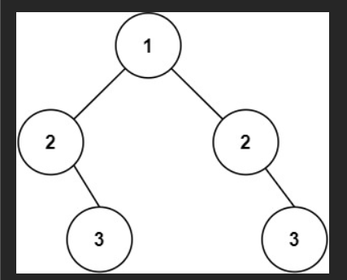

# 记录
- 题目：
  给你一个二叉树的根节点 root ， 检查它是否轴对称。（注意包括节点的值，我因为没考虑到节点的值，一开始的做法是错的）
- 链接：<https://leetcode.cn/problems/symmetric-tree/description/?envType=study-plan-v2&envId=top-100-liked>
- 思路：对根的左右分别执行相反的遍历，左边按作序遍历，右边按右序遍历，然后进行某些记录
- 开始的做法：
  我想的是使用全局列表，记录从尾部返回时的深度，然后比较两个列表是否相等。
  这出了一个问题，就是深度不一定能反应对称关系，如果左右两边都是单子树的，好比
  也会被判断为对称。
  这里我通过给遍历到空节点时记录-1解决了。
  但是还有第二个问题，就是因为我没有考虑到其实节点自身的值也算的。所以我把列表记录改了改，改成记录节点的值。
  代码如下：
  ```cpp
    /**
    * Definition for a binary tree node.
    * struct TreeNode {
    *     int val;
    *     TreeNode *left;
    *     TreeNode *right;
    *     TreeNode() : val(0), left(nullptr), right(nullptr) {}
    *     TreeNode(int x) : val(x), left(nullptr), right(nullptr) {}
    *     TreeNode(int x, TreeNode *left, TreeNode *right) : val(x), left(left), right(right) {}
    * };
    */
    class Solution {
    public:
    vector<int> le;
    int l = 0;
    int r = 0;
    vector<int> ri;
    bool isSymmetric(TreeNode* root) {
        if(root == nullptr){
            return true;
        }
        toolL(root->left);
        toolR(root->right);
        int sl = this->le.size();
        int sr = this->ri.size();
        
        if(sl!=sr){
            return false;
        }
        else{
            for(int i = 0;i<sl;i++){
                if(this->le[i]!=this->ri[i]){
                    return false;
                }
            }
        }
        return true;
    }
    void toolR(TreeNode* root){
        if(root == nullptr){
            this->r--;
            this->ri.emplace_back(-1);
            return;
        }
        else{
            this->r++;
            this->toolR(root->right);
            this->r++;  
            this->toolR(root->left);
            this->ri.emplace_back(root->val);
        }
        this->r--;
    }
    void toolL(TreeNode* root){
        if(root == nullptr){
            this->l--;
            this->le.emplace_back(-1);
            return;
        }
        else{
            this->l++;
            this->toolL(root->left);
            this->l++;
            this->toolL(root->right);
            this->le.emplace_back(root->val);
        }
        this->l--;
    }
    };
  ```
  结果：通过了，但是用时和空间都非常差，击败个位数。
- 他人的做法：
  代码如下：
  ```cpp
    class Solution {
    public:
        bool isSymmetric(TreeNode* root) {
            if (!root) return true;
            return check(root->left, root->right);
        }

        bool check(TreeNode* p, TreeNode* q)
        {
            if (!p && !q) 
                return true;
            if (!p || !q) 
                return false;
            return p->val == q->val
                && check(p->left, q->right)
                && check(p->right, q->left);
        }
    };
  ```
  - 解释：
    其实我一开始也想的是双指针同步遍历，但 是觉得没法同步，这个做法就很完美