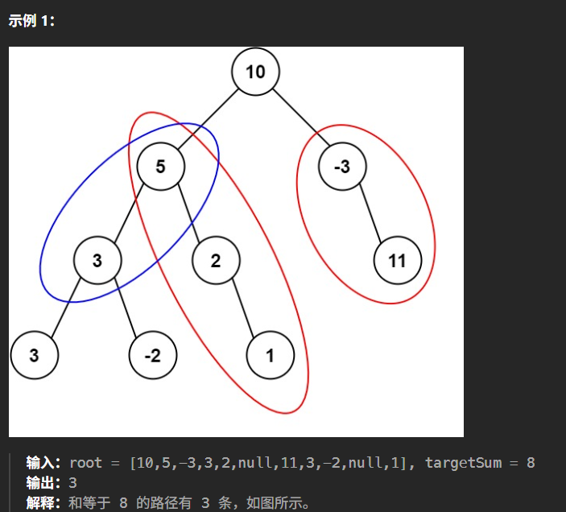

# 记录
- 题目：
  给定一个二叉树的根节点 root ，和一个整数 targetSum ，求该二叉树里节点值之和等于 targetSum 的 路径 的数目。
  路径 不需要从根节点开始，也不需要在叶子节点结束，但是路径方向必须是向下的（只能从父节点到子节点）。
- 示例：
  
- 思路：
  老样子递归，先序，加上当前结点的和，返回时再减去，有几次和目标值一样就有几条，但是这样是以初始结点为最高结点的路径情况，所以还要再一次递归，对每个结点都这样操作。
  有意思的是，提交后出现了整数溢出的报错，我思考良久，决定给和值使用long long。我翻了下评论区，还真是这样，并且不少人吐槽在这题里加一个long long的测试用例很莫名奇妙。
- 代码：
  ```cpp
  /**
  * Definition for a binary tree node.
  * struct TreeNode {
  *     int val;
  *     TreeNode *left;
  *     TreeNode *right;
  *     TreeNode() : val(0), left(nullptr), right(nullptr) {}
  *     TreeNode(int x) : val(x), left(nullptr), right(nullptr) {}
  *     TreeNode(int x, TreeNode *left, TreeNode *right) : val(x), left(left), right(right) {}
  * };
  */
  class Solution {
  public:
      //vector<int> v;
      long long sum = 0;
      int path = 0;
      int pathSum(TreeNode* root, int targetSum) {
          this->tool2(root,targetSum);
          return this->path;
      }
      void tool(TreeNode* root,int targetSum){
          if(root == nullptr) return;
          //this->v.emplace_back(root->val);
          this->sum+=root->val;
          if(sum == targetSum) this->path++;
          tool(root->left,targetSum);
          tool(root->right,targetSum);
          //this->v.pop_back();
          this->sum -= root->val;
      }
      void tool2(TreeNode* root,int targetSum){
          if(root == nullptr) return;
          this->tool(root,targetSum);
          this->tool2(root->right,targetSum);
          this->tool2(root->left,targetSum);
      }
  };
  ```
- 结果：
  时间7.33%，空间近乎100%。
  但是我看了看，都是用的这种双重递归的方法。
  有一个人附上了代码，和我的差不多，都是三个函数，有点区别的是他没有使用加，而是减，让目标值减去当前结点值，为0（结点值与目标值）的时候说明是有效的路径。
- 突然发现还有官方的做法
  - 做法一：双重递归
    ```cpp
    class Solution {
    public:
        int rootSum(TreeNode* root, long long targetSum) {
            if (!root) {
                return 0;
            }

            int ret = 0;
            if (root->val == targetSum) {
                ret++;
            } 

            ret += rootSum(root->left, targetSum - root->val);
            ret += rootSum(root->right, targetSum - root->val);
            return ret;
        }

        int pathSum(TreeNode* root, int targetSum) {
            if (!root) {
                return 0;
            }
            
            int ret = rootSum(root, targetSum);
            ret += pathSum(root->left, targetSum);
            ret += pathSum(root->right, targetSum);
            return ret;
        }
    };

    ```
    好看多了，思路是一样的。
    时间复杂度为$O（N^2）$,空间复杂度为$O(N)$
  - 做法二，前缀和
    ```cpp
    class Solution {
    public:
        unordered_map<long long, int> prefix;

        int dfs(TreeNode *root, long long curr, int targetSum) {
            if (!root) {
                return 0;
            }

            int ret = 0;
            curr += root->val;
            if (prefix.count(curr - targetSum)) {
                ret = prefix[curr - targetSum];
            }

            prefix[curr]++;
            ret += dfs(root->left, curr, targetSum);
            ret += dfs(root->right, curr, targetSum);
            prefix[curr]--;

            return ret;
        }

        int pathSum(TreeNode* root, int targetSum) {
            prefix[0] = 1;
            return dfs(root, 0, targetSum);
        }
    };
    ```
    时间复杂度$O(N)$,空间复杂度$O(N)$。
    解析：
    这里利用map来记录前缀和。
    假设根结点为root，比如`root→p1→p2→…→pk→node`。
    会记录root的值，root+p1的值，root+P2的值，root+pk的值。
    如果到了结点node，当前curr的值是root一直加到node，如果`curr - targetSum`在map中，比如说是root的值，那也就意味着`curr-root->val == targetSum`,也就意味着从p1到node是一条有效路径。
    因为路径可能刚好从root出发，这时`curr - targetSum == 0`，故此需要先`prefix[0] = 1`;
    这种方式只要遍历每个结点一次，使用的map也只有结点数个元素。
    这种方式妙在用根到结点的总路径减去已知路径来遍历以结点为尾部的路径，同时递归过程又遍历了以任何结点为尾部的路径。
    需要`prefix[curr]++;`以处理0或者正负相抵出现的情况。
    需要`prefix[curr]--;`因为返回了说明当前前缀已经无效。防止影响到其他路。等回到根结点时一切归0，除了prefix[0]。

